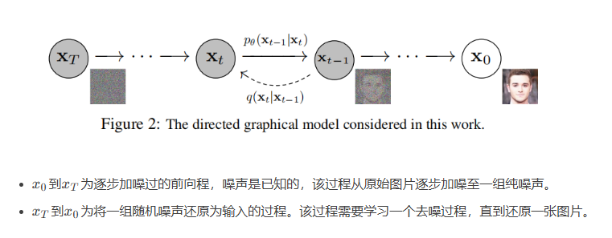
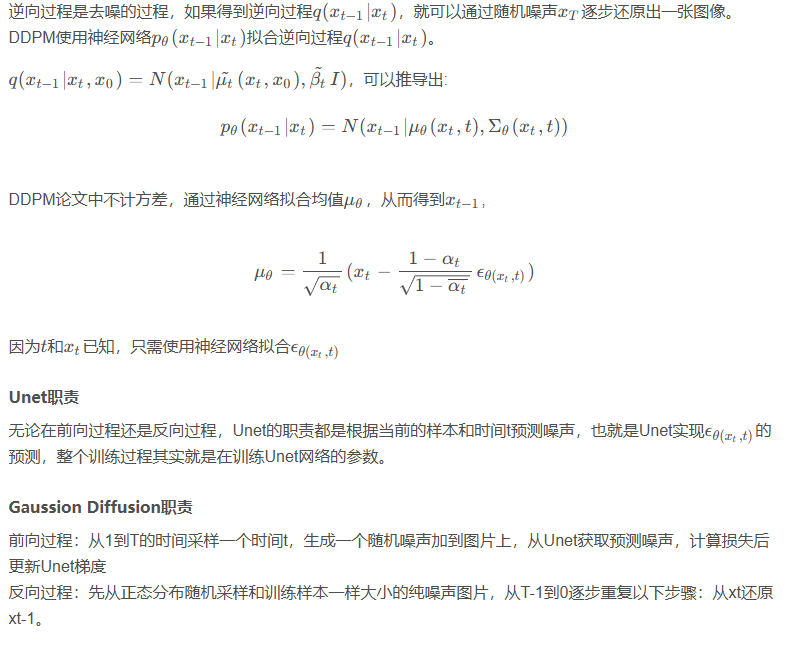

# 介绍有关DDPM的信息

来源：https://blog.csdn.net/weixin_37817275/article/details/129817654

## 1 原理介绍

DDPM是一种扩散模型，用于从噪声（采样自标准正太分布）生成目标数据样本。

包括两个过程：forward process和reverse process，前向过程也叫做diffusion过程，反向过程则用于生成数据样本。

### 1.1 前向过程

前向过程是加噪过程，并且$x_t$时刻的图片只与$x_{t - 1}$ 时刻的图片有关。

### 1.2 反向过程

反向是去噪过程。数学推导不看了，看不明白。

DDPM主要应该学的就是这个反向过程。

## 2 算法架构

模型主要有以下几块：Unet、GaussianDiffusion、Trainer。

算法主要由两部分组成：Training和Sampling。

